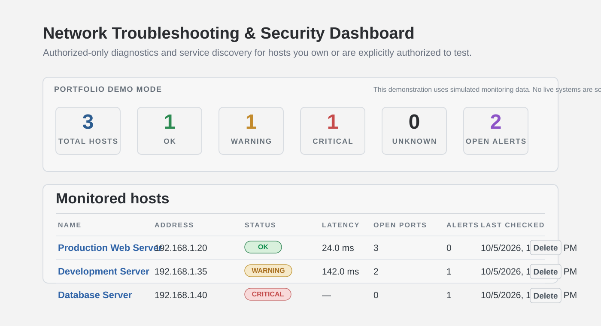
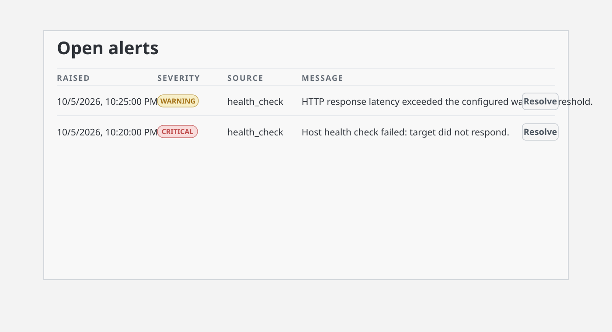
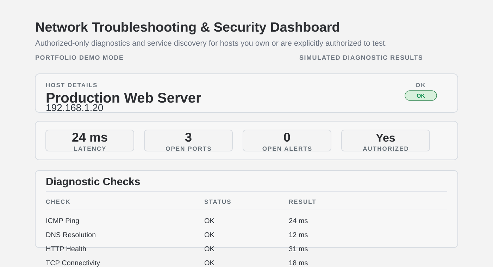
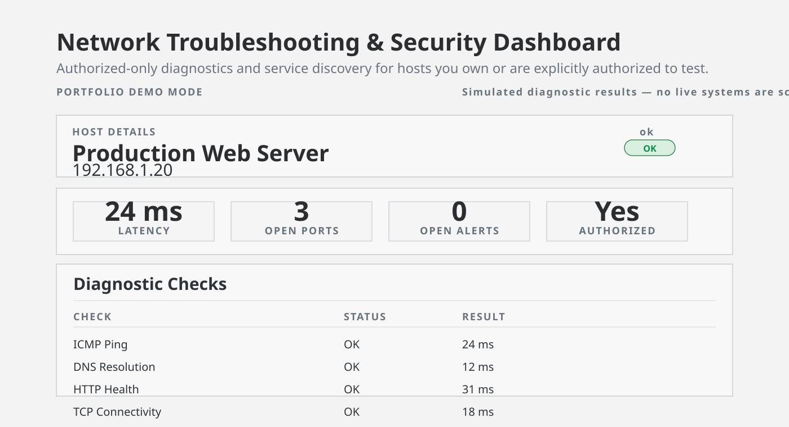
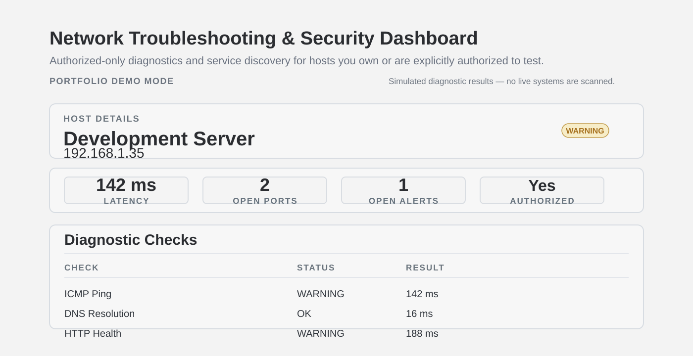
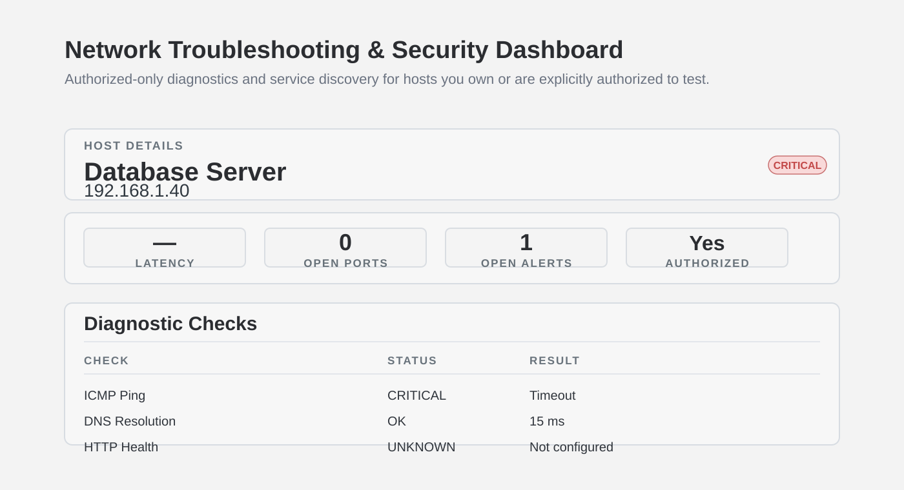
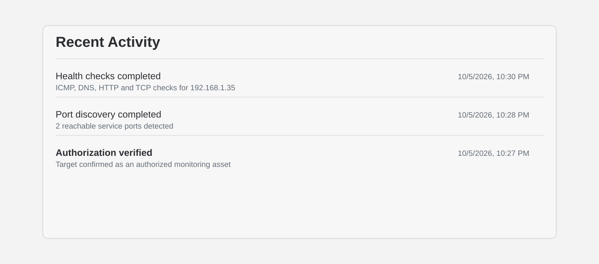

# Network Troubleshooting & Security Dashboard

A dashboard for running **authorized-only** network diagnostics and basic
Nmap service discovery against hosts you own or are explicitly permitted
to test — with results stored in PostgreSQL, automatic issue detection,
and a REST API + React frontend.

Built as a portfolio project targeting Deployment & Maintenance Software
Engineer work: Linux networking, Python/FastAPI, PostgreSQL, Docker,
and troubleshooting tooling — not a general-purpose security scanner.

> **This tool does not, and will not, implement exploitation, credential
> attacks, persistence, evasion, or malware.** It observes and reports on
> hosts you've explicitly registered as authorized. See "Authorized
> scanning" below for exactly how that's enforced.

## Screenshots

These images show the dashboard in its core operating states: high-level
summary, alert review, per-host diagnostics, and security/activity monitoring.

### Dashboard overview



### Open alerts



### Host detail view



### Security controls and recent activity



### Development server warning state



### Development server diagnostics


### Database server diagnostics



### Recent activity and authorization state



## 1. Architecture

```
 Browser (React SPA)
        │  fetch() → JSON over HTTP
        ▼
 FastAPI backend  ──────────────► PostgreSQL
        │  subprocess (fixed argv, never shell=True)     (hosts, checks,
        ├──► nmap        (TCP connect scan, -sT)          scans, ports,
        ├──► ping / traceroute (stdlib subprocess)        alerts)
        ├──► socket / urllib (dns, tcp, http checks)
        └──► tshark (optional, off by default)
```

The React frontend **never** calls Nmap, ping, or any OS tool directly —
it only ever talks to the FastAPI REST API over HTTP. Every safety check
(target validation, authorization gates) lives server-side, so it can't
be bypassed by a modified or malicious frontend request.

### Backend package layout
```
backend/app/
├── main.py            # FastAPI app, CORS, router wiring, lifespan (DB init)
├── config.py            # pydantic-settings: all config from env vars
├── database.py            # SQLAlchemy engine/session
├── models.py                # Host, HealthCheck, Scan, Port, Alert
├── schemas.py                  # Pydantic request/response models + validators
├── routers/
│   ├── hosts.py                   # CRUD for monitored hosts
│   ├── checks.py                    # run/list network diagnostics
│   ├── scans.py                        # run/list Nmap scans
│   ├── alerts.py                          # list/resolve alerts
│   └── dashboard.py                          # aggregated summary
└── services/
    ├── validation.py      # single-target validation (no CIDR, no shell metachars)
    ├── network_checks.py    # dns / ping / tcp / http / traceroute
    ├── nmap_scanner.py         # nmap subprocess + XML parsing
    ├── packet_capture.py          # optional tshark summary (off by default)
    └── issue_detection.py             # turns results into Alert rows
```

## 2. How the pieces communicate

1. User adds a host via the React form → `POST /api/hosts` → FastAPI
   validates the address (single host, no CIDR) and requires
   `authorized_confirmation: true` → stored in Postgres.
2. User clicks "Run diagnostics" → `POST /api/hosts/{id}/checks/run` →
   backend runs DNS/ping/traceroute/HTTP checks via stdlib
   `socket`/`urllib`/`subprocess` → results + any alerts stored →
   returned as JSON → frontend re-renders.
3. User clicks "Run scan" (with the per-scan authorization checkbox
   ticked) → `POST /api/hosts/{id}/scans` → backend re-validates the
   target, shells out to `nmap -sT --top-ports N -oX -`, parses the XML,
   stores ports, compares against the host's expected-port allow-list,
   raises alerts for mismatches → returned as JSON.
4. Dashboard/alert views poll the relevant `GET` endpoints and render
   what's in Postgres — no direct DB access from the frontend, ever.

## 3. Features

- **Dashboard**: online/offline-style status per host (from the latest
  health check), latency, open port count, unresolved alert count, last
  checked time.
- **Authorized network diagnostics**: DNS resolution, ICMP ping (parsed
  latency), TCP port connectivity, HTTP/HTTPS health check, traceroute —
  each with a clear, specific error message on failure and graceful
  "unknown" reporting when a tool isn't installed.
- **Nmap integration**: enter an authorized host, run a basic
  `-sT --top-ports N` service-discovery scan, parse the XML, store ports
  + detected service/product/version, every scan timestamped.
- **Issue detection**: host unreachable, DNS failure, high latency
  (configurable threshold), HTTP service unavailable, an expected port
  missing, or an unexpected open port found — each becomes a stored
  `Alert` row.
- **PostgreSQL storage** for hosts, health checks, scans, ports, and
  alerts, all timestamped.
- **REST API** (FastAPI) with request validation, structured error
  responses, structured logging, and interactive docs at `/docs`.
- **React/TypeScript dashboard**: overview, host list, host detail
  (diagnostics + scan history + port table), alert view with resolve
  action.

## 4. Installation (Ubuntu)

Tested against Ubuntu 22.04/24.04.

```bash
sudo apt update
sudo apt install -y python3 python3-venv python3-pip nodejs npm docker.io docker-compose-plugin \
    nmap iputils-ping traceroute postgresql-client

git clone <your-repo-url> network-dashboard
cd network-dashboard
cp .env.example .env
# edit .env: set a real POSTGRES_PASSWORD at minimum
```

Backend, without Docker (against a local Postgres):
```bash
cd backend
python3 -m venv .venv && source .venv/bin/activate
pip install -e ".[dev]"
export $(grep -v '^#' ../.env | xargs)   # load env vars into this shell
uvicorn app.main:app --reload
```

Frontend, without Docker:
```bash
cd frontend
npm install
VITE_API_BASE_URL=http://localhost:8000 npm run dev
```

## 5. Docker setup

```bash
cp .env.example .env      # if you haven't already
# edit .env and set a real POSTGRES_PASSWORD

docker compose up -d --build
```

This starts `db` (Postgres 15), `backend` (FastAPI + nmap/ping/traceroute),
and `frontend` (the built React app served by nginx). By default:
- Frontend: http://localhost:8080
- Backend API + docs: http://localhost:8000/docs
- Postgres: localhost:5432

## 6. Authorized scanning — how it's enforced, not just stated

This project's core safety requirement is: **only scan hosts you own or
are explicitly authorized to test.** That's enforced structurally, not
just documented:

1. **Single-target only.** `services/validation.py` rejects any address
   containing `/` (CIDR ranges), whitespace, or shell metacharacters. You
   can only ever register and scan one specific host, never a subnet.
2. **Authorization gate #1 — at host creation.** `POST /api/hosts`
   requires `authorized_confirmation: true` in the request body,
   enforced by a Pydantic validator that rejects anything else with a
   422. There is no way to create a host record without this.
3. **Authorization gate #2 — at scan time, every time.** `POST
   /api/hosts/{id}/scans` separately requires `authorization_ack: true`
   in that specific request. Confirming once when adding a host is not
   enough — every individual scan re-confirms authorization.
4. **No arbitrary Nmap flags.** The scan command is a fixed argv list
   (`nmap -sT -T3 --top-ports N -oX - <target>`) built entirely by the
   backend; nothing from the request reaches the command line except the
   already-validated target and a bounded port count.
5. **`-sT`, not `-sS`.** TCP connect scan needs no root/raw sockets,
   which also means it's more visible to logging on the target — a
   deliberate trade-off toward honesty over stealth, documented so you
   can explain *why* in an interview.
6. **No aggressive/vuln scripts, no OS fingerprinting, no UDP scan.**
   Kept out entirely — see Security section.

**What this can't do:** verify that you actually own or have permission
for a host — no piece of software can. It makes it structurally
inconvenient to scan something without deliberately confirming
authorization twice, which is the realistic ceiling for this kind of
project.

## 7. API

Interactive OpenAPI docs are served at `/docs` (Swagger UI) and `/redoc`
once the backend is running. Key endpoints:

| Method | Path | Purpose |
|---|---|---|
| POST | `/api/hosts` | Register a host (requires `authorized_confirmation: true`) |
| GET | `/api/hosts` | List hosts with latest status summary |
| GET | `/api/hosts/{id}` | Host detail |
| DELETE | `/api/hosts/{id}` | Remove a host |
| POST | `/api/hosts/{id}/checks/run` | Run dns/ping/traceroute/http checks now |
| GET | `/api/hosts/{id}/checks` | Recent check history |
| POST | `/api/hosts/{id}/scans` | Run an Nmap scan (requires `authorization_ack: true`) |
| GET | `/api/hosts/{id}/scans` | Scan history (with ports) |
| GET | `/api/scans/{id}` | Single scan detail |
| GET | `/api/alerts` | List alerts (filter by `host_id`, `resolved`, `severity`) |
| POST | `/api/alerts/{id}/resolve` | Mark an alert resolved |
| GET | `/api/dashboard/summary` | Aggregated counts for the dashboard |
| GET | `/api/system/health` | API liveness check |

## 8. Database

Schema (`app/models.py`), created automatically on backend startup via
`SQLAlchemy.metadata.create_all()` — **no migration framework** (see
Limitations). Tables: `hosts`, `health_checks`, `scans`, `ports`,
`alerts`, all with timestamps and foreign keys back to `hosts`/`scans`
with `ON DELETE CASCADE`.

## 9. Troubleshooting

| Symptom | Likely cause | Fix |
|---|---|---|
| Frontend shows "Could not reach the backend API" | Backend not running, or wrong `VITE_API_BASE_URL` | Check `docker compose logs backend`; confirm the URL baked into the frontend build matches where the app is served. |
| `422 Unprocessable Entity` on adding a host | `authorized_confirmation` missing/false, or address looks like a CIDR range | Tick the authorization checkbox; use a single IP/hostname, not a `/24` |
| Scans always fail with "nmap is not installed" | Running the backend outside Docker without nmap installed | `sudo apt install nmap`, or use `docker compose up` (nmap is baked into the backend image). |
| Ping checks report `critical`/permission errors inside Docker | Unprivileged ICMP sockets can be blocked by the container's default capabilities | See Security section — this is a known, documented limitation. |
| `psycopg2.OperationalError: could not connect to server` | Postgres not up yet, or wrong `POSTGRES_HOST` | Wait for the `db` healthcheck; set `POSTGRES_HOST=localhost` if running the backend outside Docker. |
| Packet-capture / tshark features do nothing | `ENABLE_PACKET_CAPTURE` is `false` by default, and tshark isn't installed in the backend image by default | Both are intentional — see Security section. |

## 10. Security considerations

- **Authorization is structurally enforced**, not just a warning label —
  see section 6 in full.
- **No arbitrary shell command execution.** Every external tool
  (`nmap`, `ping`, `traceroute`, `tshark`) is invoked via `subprocess`
  with a fixed argument list, never `shell=True`, never a user string
  concatenated into a command. Target strings are validated before they
  ever reach a command line.
- **No exploitation, credential attacks, persistence, evasion, or
  malware** of any kind — this is a read-only observability tool.
  Scanning is limited to basic TCP service discovery (open ports +
  service/version banners), nothing more.
- **Secrets only via environment variables.** `.env` (git-ignored) holds
  the Postgres password; nothing sensitive is hardcoded or checked in.
- **Database**: parameterized queries only, via SQLAlchemy's ORM (no
  raw string-built SQL anywhere in the codebase).
- **Docker**: backend container runs as a non-root user (uid 1000).
  Nmap's `-sT` mode doesn't need elevated privileges, so no extra
  capabilities are granted to the container.
- **Known limitation — ICMP ping in containers.** Unprivileged ICMP
  (what `ping` needs) depends on the host's `net.ipv4.ping_group_range`
  sysctl and the container's capabilities. In some Docker setups, `ping`
  from inside the backend container will report a permission error
  rather than a real network result. This is called out here rather than
  hidden — TCP/HTTP checks and Nmap scans are unaffected.
- **Packet capture (tshark) is optional, disabled by default,
  feature-flagged, and scoped to `host <ip>` traffic for one
  already-authorized host** — never a general capture, and it's not
  even installed in the default Docker image. Enabling it requires
  deliberate action (installing tshark, granting capture capabilities,
  flipping `ENABLE_PACKET_CAPTURE=true`) — this is intentionally not a
  one-flag "just works" feature, because packet capture is a materially
  bigger trust boundary than a port scan.
- **CORS** is restricted to the origins listed in `CORS_ORIGINS` — not
  wildcarded.

## 11. Testing

```bash
cd backend
pip install -e ".[dev]"
pytest tests/ -v
```

57 backend tests cover: target validation (valid IPs/hostnames accepted;
CIDR ranges and shell metacharacters rejected), network diagnostics
(mocked subprocess/socket/urllib — success and failure paths for
dns/ping/tcp/http), the Nmap wrapper (XML parsing, missing-binary,
non-zero exit, timeout, and malformed-XML handling, plus a regression
guard asserting `shell=True` is never used), the optional tshark
integration, issue-detection logic, and full API integration tests
(hosts/checks/scans/alerts/dashboard) against an in-memory SQLite
database via a FastAPI dependency override — no real Postgres, network,
or Nmap binary required to run the suite.

Frontend:
```bash
cd frontend
npm install
npm run build   # type-checks with tsc, then builds — verified to pass
```

## 12. Project limitations

Being upfront about scope, since this is a solo portfolio project:

- **No database migration framework.** Schema is created via
  `SQLAlchemy.metadata.create_all()` on startup — fine for a fresh
  install, but the first thing to add (Alembic) before this held real
  production data or needed a schema change without data loss.
- **No authentication/authorization on the API itself.** Anyone who can
  reach the backend can add hosts and trigger scans. The "authorization"
  this project enforces is about *which hosts* can be scanned, not *who*
  is allowed to use the dashboard — a real deployment would sit this
  behind auth (even basic auth or a reverse-proxy login) before exposing
  it beyond localhost.
- **Alerting has no dedupe, escalation, or auto-resolve.** Every
  unhealthy check/scan produces a fresh alert row; resolving is manual.
- **Ping inside Docker may not work everywhere** (see Security section)
  — a real limitation of unprivileged ICMP in containers, not a bug in
  this code.
- **Traceroute output parsing is minimal** (hop count only, no per-hop
  latency extraction).
- **tshark/packet-capture support is intentionally shallow** — a
  protocol-count summary, not packet inspection, and off by default.
- **No CI pipeline included** — tests are run manually; wiring this into
  GitHub Actions would be a natural next step.

## License

MIT — use this however is useful to you.
